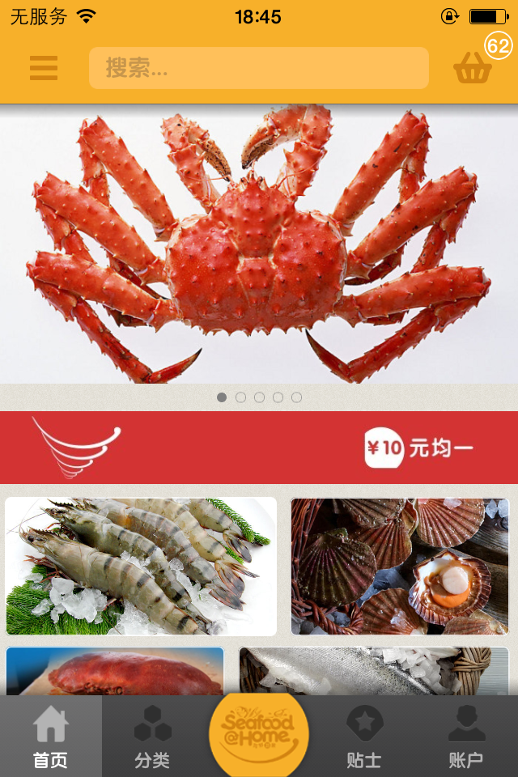
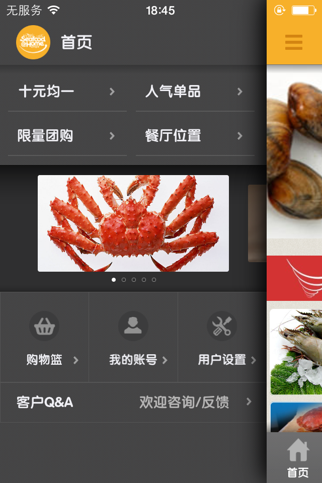
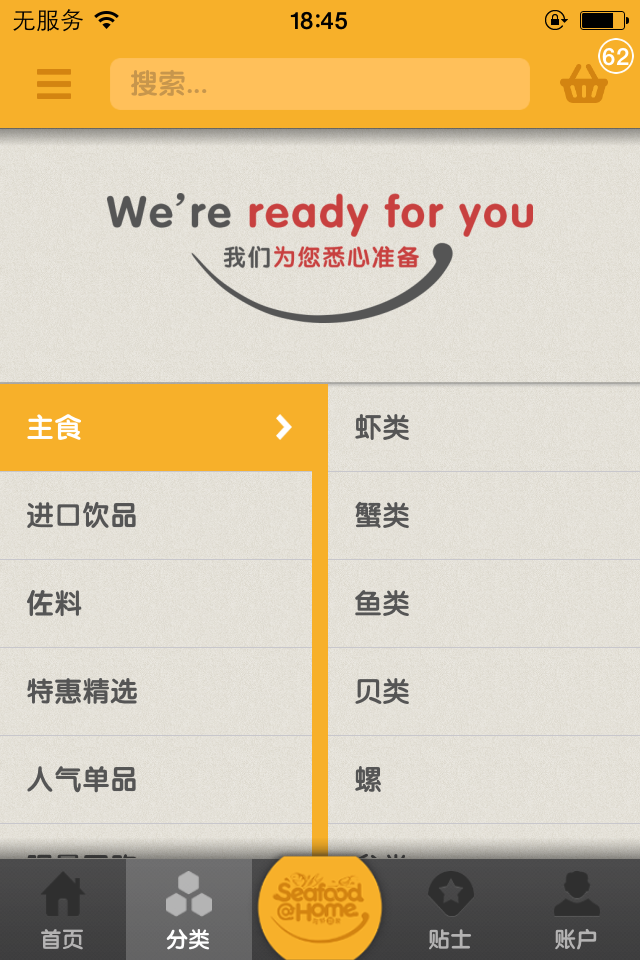
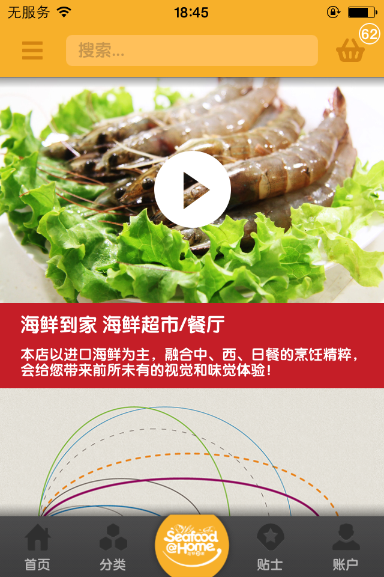

# Seafood-At-Home

 

 

The owner abandoned the project because, now open source .

Seafood-At-Home for iOS on the App Store on iTunes Source Code.
[https://itunes.apple.com/us/app/hai-xian-dao-jia/id962663219?l=zh&ls=1&mt=8](https://itunes.apple.com/us/app/hai-xian-dao-jia/id962663219?l=zh&ls=1&mt=8)

> **Demo Account**
>
> Username:15918550637
>
> Password: abc

**Important Note: This item only learning to use, prohibit the use of the item for other purposes.**

---

## Introduce

本店以进口海鲜为主，针对广州本地区客户对海鲜的购买需求而量身定做，带给您前所未有的视觉和味觉体验，还有更多惊喜等着您哦。
新西兰的青口和鳌虾、法国的银鳕鱼和生蚝、澳洲的鲍鱼和龙虾、加拿大的翡翠螺还有海胆越南虎虾、挪威三文鱼、北海道松叶蟹、朝鲜赤贝、波斯湾龙虾等等......

种类齐全应有尽有，来到海鲜到家，保证满足您所有味蕾！

## Screenshots
<table align="center">
    <tr>
        <td></td>
       <td></td>
    </tr>
    <tr>
        <td></td>
       <td></td>
    </tr>
    <tr>
        <td></td>
       <td></td>
    </tr>
</table>

## Requirements

* Xcode 6 or higher
* Apple LLVM compiler
* iOS 7.0 or higher
* ARC

## LICENSE

`Seafood-At-Home` is available under the GPL license.

**Important Note: This item only learning to use, prohibit the use of the item for other purposes.**

## Contact

If you have any questions or suggestions, contact me `QQ724849296` or call `+8615918550637`, please.

