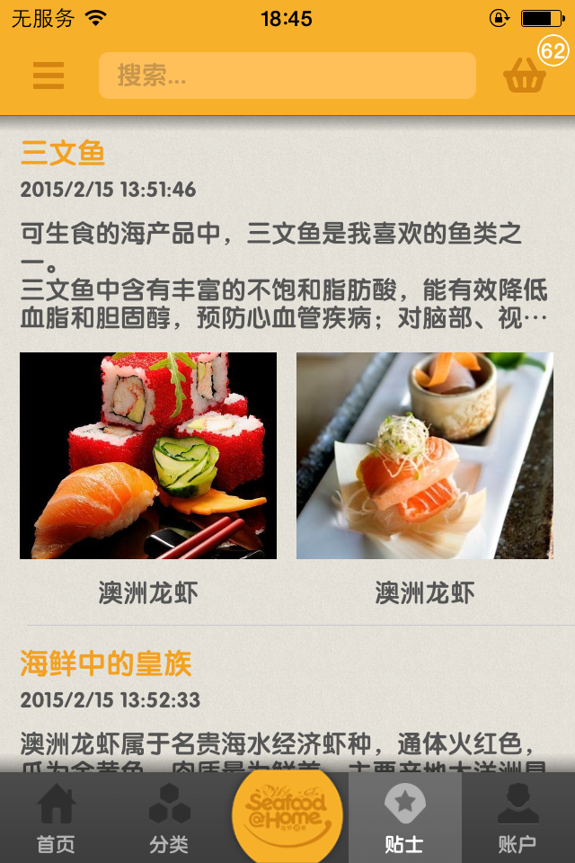

# Seafood-At-Home

The owner abandoned the project because, now open source .

Seafood-At-Home for iOS on the App Store on iTunes Source Code.
[https://itunes.apple.com/us/app/hai-xian-dao-jia/id962663219?l=zh&ls=1&mt=8](https://itunes.apple.com/us/app/hai-xian-dao-jia/id962663219?l=zh&ls=1&mt=8)

> Demo Account
>
> Username:15918550637
>
> Password: abc

**Important Note: This item only learning to use, prohibit the use of the item for other purposes.**

---
## Screenshots
<table align="center">
    <tr>
        <td></td>
       <td></td>
    </tr>
    <tr>
        <td></td>
       <td></td>
    </tr>
    <tr>
        <td></td>
       <td></td>
    </tr>
</table>

## Requirements

* Xcode 6 or higher
* Apple LLVM compiler
* iOS 7.0 or higher
* ARC

## LICENSE

`Seafood-At-Home` is available under the GPL license.

**Important Note: This item only learning to use, prohibit the use of the item for other purposes.**

## Contact

If you have any questions or suggestions, contact me `QQ724849296` or call `+8615918550637`, please.

